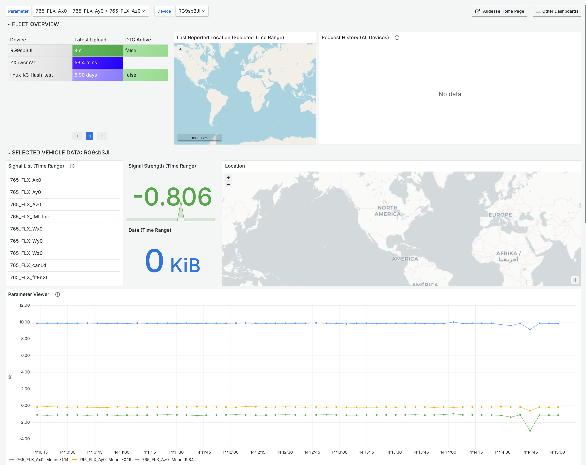
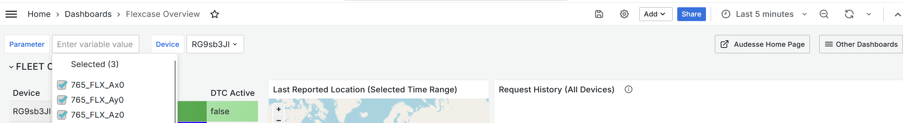
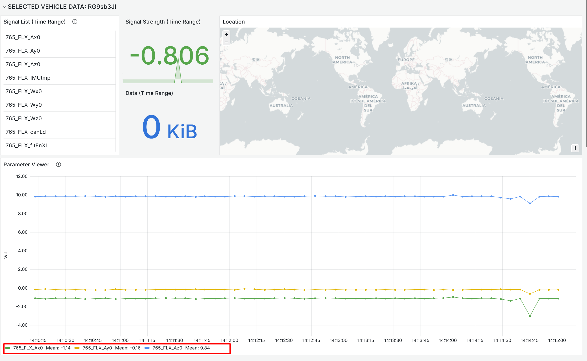

# Getting Started with FlexConnect

Welcome to the FlexConnect documentation. This site provides information on how to get started with your FlexCase and the FlexConnect portal.

## Prerequisites

- FlexConnect credentials for the FlexConnect portal. Contact Audesse if you have not yet received them.
- A FlexCase with FlexConnect installed and a fitted SIM card. Devices ship by default with a 1nce SIM.
  - If you opted for a different SIM provider, or a modem-less configuration, make sure your device is configured to connect to the internet.
- A DBC file that defines the CAN messages your device will publish.
- Optional FlexConnect API access if you intend to publish custom data from the MCU using the C API or from the MPU using the Python API. Sample code and headers are available from Audesse.

## Logging In

Access the FlexConnect portal in either of the following ways:

- Navigate to the Audesse website and select FlexConnect from the portal dropdown.

- Go directly to [Audesse's Grafana](https://grafana.audesseinc.com).

Enter the credentials provided by Audesse. On first login, you will see your default dashboard.

> The portal is built on Grafana, an open-source dashboard framework. Grafana documentation and tutorials apply to everything outside the Audesse-supplied control panel widget.

## Dashboard Overview

After logging in, you will see your fleet dashboard. The default configuration includes the following widgets:

| Widget          | What it shows                                                             |
| --------------- | ------------------------------------------------------------------------- |
| Device Overview | Last upload time, active fault codes, and SIM data usage for each device. |
| Fleet Map       | Location of all devices within the selected time range.                   |
| Event Log       | Configuration changes and other important debugging events.               |
| Signal Viewer   | Time-series graph of signals published by your devices.                   |

Use the time range selector, such as Last 5 minutes or Last 30 days, at the top of the dashboard to control the data window shown across all widgets.

## Multiple Dashboards and Access Levels

You have access to all dashboards in your account. Audesse can create additional dashboards for you, along with separate login credentials for drivers or customers. These accounts can be restricted to specific dashboards, giving them a limited view of the fleet.

## Selecting a Device and Viewing Data

The dashboard includes a Selected Vehicle panel for viewing data from a specific device.

1. Locate the device selector dropdown. Device names match the label code printed on the FlexCase unit, for example UKK or SHP.
2. Select the device you want to inspect.
3. Use the parameter list to choose which signals to display, for example accelerometer data.
   
   
4. Set the time range. The signal graph and parameter viewer will update to show data for that device within that window.
5. To view multiple signals at once, hold Ctrl and select each signal in the parameter list.

The Selected Vehicle panel also shows:

- Signal strength and data consumed during the selected time period.
- Device path on a map, if the device was moving.

> Signal field names come directly from your DBC file. See the DBC upload guidance below for details on uploading and managing DBC files.
