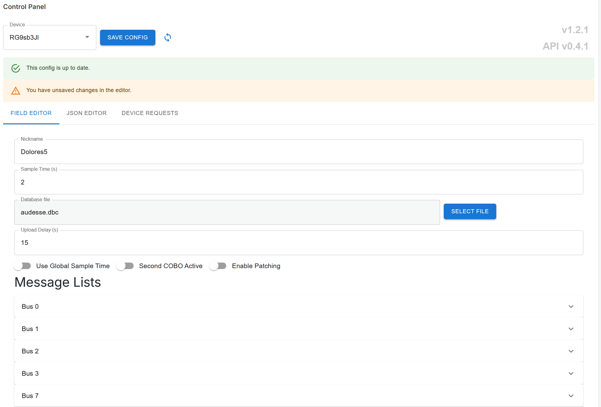
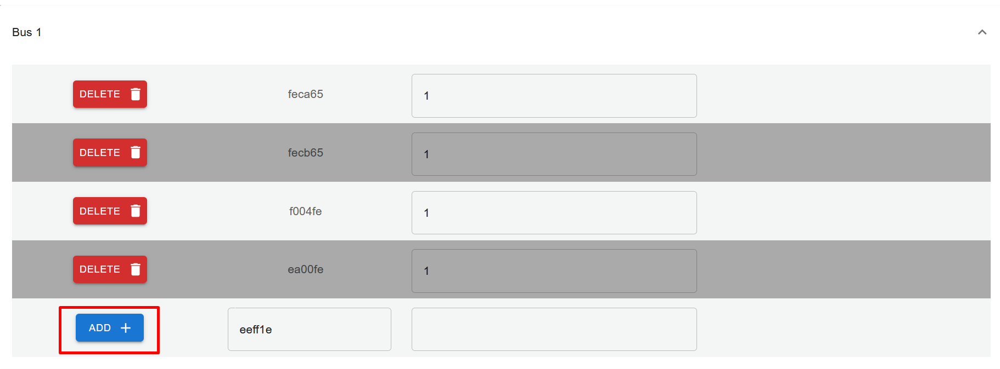
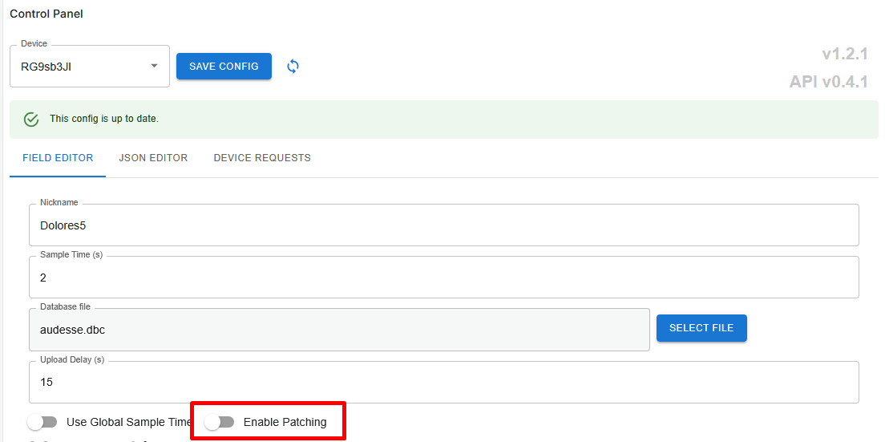
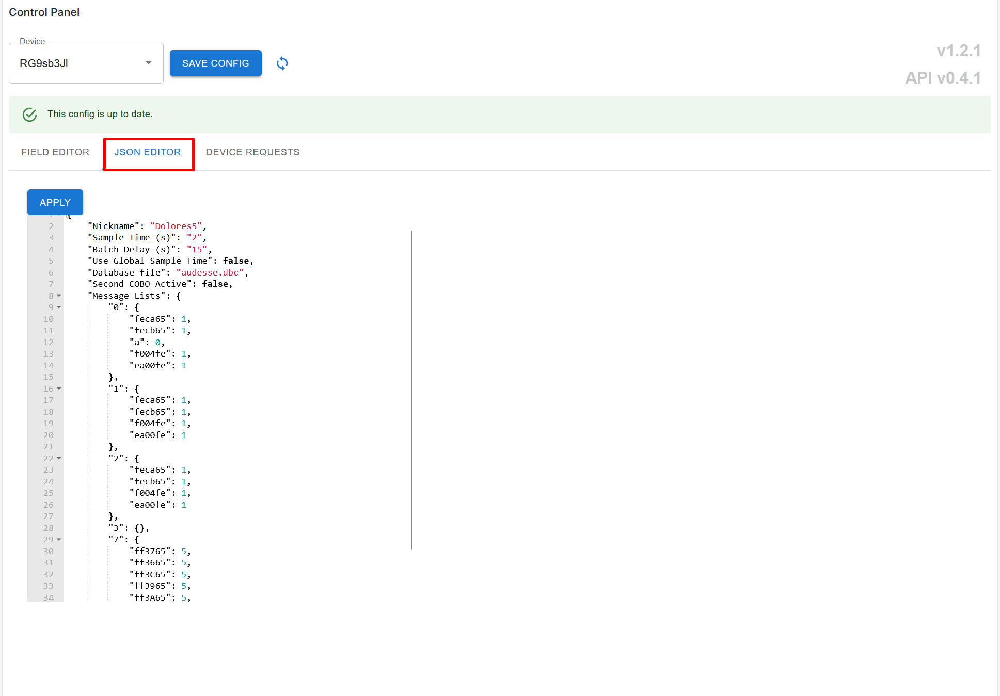
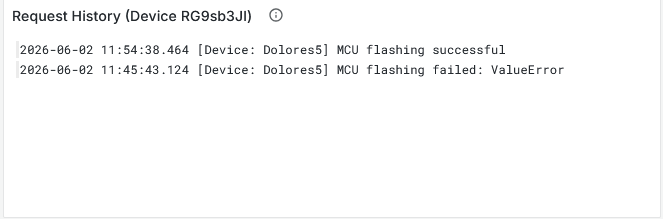
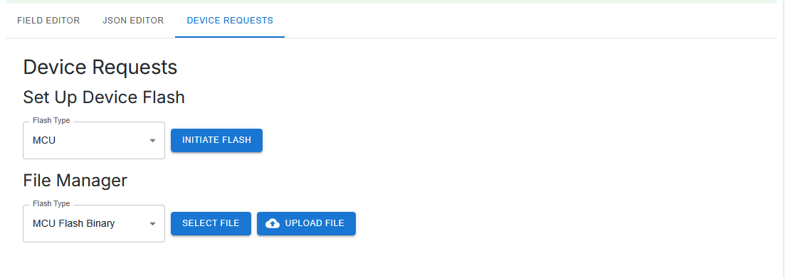
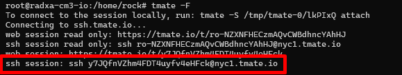
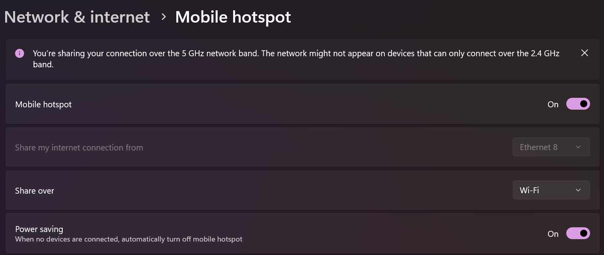
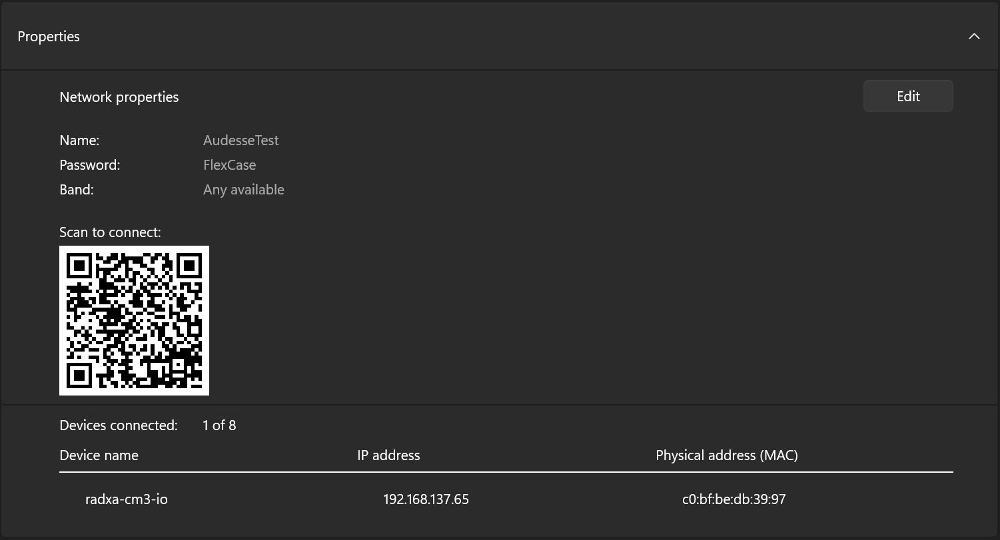

# Getting Started with FlexConnect

## Prerequisites

- FlexConnect credentials for the FlexConnect portal. Contact Audesse if you have not yet received them.
- A FlexCase with FlexConnect installed and a fitted SIM card. Devices ship by default with a 1nce SIM.
  - If you opted for a different SIM provider, or a modem-less configuration, make sure your device is configured to connect to the internet.
- A DBC file that defines the CAN messages your device will publish.
- Optional FlexConnect API access if you intend to publish custom data from the MCU using the C API or from the MPU using the Python API. Sample code and headers are available from Audesse.

## Logging In

Access the FlexConnect portal in either of the following ways:

- Navigate to the Audesse website and select FlexConnect from the portal dropdown.

- Go directly to [Audesse's Grafana](https://grafana.audesseinc.com).

Enter the credentials provided by Audesse. On first login, you will see your default dashboard.

> The portal is built on Grafana, an open-source dashboard framework. Grafana documentation and tutorials apply to everything outside the Audesse-supplied control panel widget.

## Dashboard Overview

After logging in, you will see your fleet dashboard. The default configuration includes the following widgets:

| Widget          | What it shows                                                             |
| --------------- | ------------------------------------------------------------------------- |
| Device Overview | Last upload time, active fault codes, and SIM data usage for each device. |
| Fleet Map       | Location of all devices within the selected time range.                   |
| Event Log       | Configuration changes and other important debugging events.               |
| Signal Viewer   | Time-series graph of signals published by your devices.                   |

Use the time range selector, such as Last 5 minutes or Last 30 days, at the top of the dashboard to control the data window shown across all widgets.


## Multiple Dashboards and Access Levels

You have access to all dashboards in your account. Audesse can create additional dashboards for you, along with separate login credentials for drivers or customers. These accounts can be restricted to specific dashboards, giving them a limited view of the fleet.

## Selecting a Device and Viewing Data

The dashboard includes a Selected Vehicle panel for viewing data from a specific device.

1. Locate the device selector dropdown. Device names match the label code printed on the FlexCase unit, for example UKK or SHP.
2. Select the device you want to inspect.
3. Use the parameter list to choose which signals to display, for example accelerometer data.
   
   
4. Set the time range. The signal graph and parameter viewer will update to show data for that device within that window.
5. To view multiple signals at once, hold Ctrl and select each signal in the parameter list.

The Selected Vehicle panel also shows:

- Signal strength and data consumed during the selected time period.
- Device path on a map, if the device was moving.

> Signal field names come directly from your DBC file. See the DBC upload guidance below for details on uploading and managing DBC files.

## Device Control Panel

Each device has a control panel widget, developed by Audesse, that lets you configure the device. All other widgets on the dashboard are standard Grafana components and can be customized freely.

### Renaming a Device

1. Select your device in the control panel.
2. Edit the Nickname field.
3. Click Save. The alias will appear in the device selector on the next page refresh.

### Adjusting Sample Time and Upload Delay

Two parameters control data volume and compression efficiency:

- Upload Delay: how often, in seconds, the device sends a message to the cloud. During this interval, data is collected continuously and compressed before upload. A longer upload delay improves compression efficiency.
- Sample Time: a global rate, in samples per second, applied to all signals. Individual message sample rates can be overridden in the message list.

> A data usage calculator is available from Audesse to help you optimize these settings for your application.

### Managing the Message List

The device comes configured with a set of messages and a dbc file, these collect generic data like rssi, latency, and CAN bus load. The message list maps the preconfigured CAN IDs, derived from your DBC file, to sample rates. To filter which messages are collected from a device:

- Delete unwanted entries in the message list and add your own.
- Specify a per-message sample rate.
	- 

> CAN IDs in the message list are in hexadecimal. Use Python or any hex converter to translate from your DBC file if needed.

### Uploading a DBC File

A DBC file defines how the FlexCase parses CAN messages. To upload or update a DBC for a device:

1. In the control panel, select the DBC file option.
2. Choose your DBC file and click Save.
3. The FlexCase will download the updated DBC on its next boot.

DBC files can be edited as plain text or with any DBC editing tool. Recommended approaches for managing multiple configurations:

- Maintain one DBC per device, uploaded via the control panel or through the FlexConnect API for bulk operations.
- Alternatively, use a single master DBC covering all configurations and filter messages per device using the message list.

### Firmware and System Versions

The control panel displays the version of the FlexConnect system running on your device. Enable Patch Flag to automatically apply patches published by Audesse.



### JSON Configuration
If you prefer to manage device configuration as code, the control panel allows editing the entire device configuration as a JSON object. Navigate to the JSON Editor tab to view and edit the JSON representation of the device configuration, including message definitions, sample rates, and other parameters. 

> Before committing changes in the JSON editor, make sure to navigate back to the Field Editor tab to verify that all fields are correctly parsed and displayed.


### Device Requests
The Device Requests tab allows you to send flash jobs to the FlexCase, giving you the ability to update the firmware on the FlexCase's MCU and other attached peripherals. To setup a flash job:
- Upload the firmware binary to FlexConnect using the File Manager section.
- Initiate a flash job by selecting the target flash type and hitting "INITIATE FLASH".
- Waif for status updates in the request history widget. The flash job will be marked as successful once the device confirms the update. 



## Data Architecture Overview

The following describes how data flows from a FlexCase to the dashboard. This is useful background for developers integrating custom data sources.

| Stage           | Description                                                                                                                                                 |
| --------------- | ----------------------------------------------------------------------------------------------------------------------------------------------------------- |
| MCU             | Collects data from connected devices, including the CAN bus, digital inputs, and sensors. Packages data as CAN messages and sends them over SPI to the MPU. |
| MPU (Linux)     | Receives data from the MCU over SPI. Parses CAN messages using the DBC file and publishes field/value pairs to the cloud over MQTT with TLS.                |
| MQTT Broker     | AWS-hosted broker that receives authenticated messages from the device.                                                                                     |
| Ingest Pipeline | Processes incoming data, parses messages, triggers alerts or events, and routes data to storage.                                                            |
| InfluxDB        | Time-series database that stores all field/value data from your devices.                                                                                    |
| Grafana / API   | Queries InfluxDB and renders data in the dashboard. Data is also accessible through the FlexConnect REST API for custom front ends.                         |

Single-message payload limit: 100 KB, including authentication overhead.

## Publishing Custom Data

In addition to standard CAN telemetry, you can publish custom data from both the MCU and the MPU.

### From the MCU (C API)

Audesse provides a C header and object file for packaging and sending data from the S32K3 MCU. Data is sent over SPI to the MPU, which handles cloud delivery.

- Package any signal, including digital input states or derived values, as a CAN message using the FlexConnect C API.
- Define the parsing for that CAN ID in your DBC file.
- Everything else, including compression, upload, and storage, is handled automatically by FlexConnect.

Contact Audesse to receive the FlexConnect C header and object file, along with any available sample code for MCU peripheral integration.

### From the MPU (Python API)

If your application runs Linux on the MPU, you can publish data directly using the Python API without packaging it as a CAN message.

- Data is sent as field-value pairs in JSON or protobuf format.
- GZIP compression is supported.
- Authentication credentials are pre-loaded on the FlexCase and can be reused by your Python scripts.

Contact Audesse for the Python API documentation and JSON or GZIP format guide.

## Downstream Messaging (Write-Back)

The FlexCase communicates with the cloud over both MQTT and HTTP:

- MQTT is the primary real-time channel. If you have credentials for a device's MQTT channel, you can publish messages downstream, for example to update configuration or control outputs.
- HTTP is used for file transfers such as DBC downloads and OTA firmware updates. FlexConnect wraps S3 with its own authentication, so any file you upload through the platform becomes available to the device via HTTP.

> If you prefer HTTP or REST over MQTT for downstream control, contact Audesse to discuss a custom interface.

## Access Management

You can create separate dashboards and login credentials to give drivers or end customers a restricted view of your fleet.

- Your account has access to all dashboards.
- Driver or customer accounts can be limited to specific dashboards, showing only the devices and signals you define.

To set this up, contact Audesse and the additional dashboard and credentials can be configured for you.

## White Labelling and Embedding

FlexConnect supports several options for integrating the dashboard into your own product.

### White Labelling

- Replace the Grafana login icon with your own logo.
- Set a custom domain, for example grafana.yourcompany.com.

Contact Audesse to arrange white labelling. This is low effort and does not require any front-end development on your part.


# Audesse Support

If Audesse needs to connect to your FlexCase for support, they should be able to connect over LTE to your device as long as it has a working SIM card and cellular signal. if no signal is available, you can fall back to Wi-Fi and follow the steps below to create a temporary remote session. 

## Granting Audesse Access
1. Turn on the FlexCase and ensure it is connected to your network with internet access.
   - The FlexCase is usually configured to connect automatically to a nearby Wi-Fi hotspot with the following credentials:
      - SSID: `AudesseTest`
      - Password: `FlexCase`
    - See [Hotspot Configuration on Windows](#hotspot-configuration-on-windows) below for instructions on setting up this hotspot on a Windows machine.
2. SSH into the FlexCase.
   - On Windows, use PowerShell or Windows Terminal. If you already use Git Bash or another terminal with `ssh` installed, that works too.
   - Run the full SSH command for your MPU module:

 ```bash
  # Radxa CM3
  ssh rock@radxa-cm3-io
 ```
  
 ```bash
  # Raspberry Pi
  ssh pi@FlexCase01
 ```
   - If the terminal asks you to confirm the host fingerprint, enter `yes` and press Enter.
   - The temporary password is `audesse_temp`.
1. Install `tmate`:

   ```bash
   sudo apt install tmate -y
   ```

2. Start `tmate`:

   ```bash
   tmate
   ```

3. Copy the SSH or web session link that `tmate` provides.
   
4. Share that link with an Audesse employee so they can connect to the device.

> Only share the `tmate` session link directly with Audesse support staff. End the session when support is complete.


### Hotspot Configuration on Windows
1. Open the Start menu and go to Settings > Network & Internet > Mobile hotspot.
2. Under "Share my Internet connection from", select the network interface that has internet access (e.g. Ethernet or Wi-Fi).
3. Change the Network name and Network password to:
   - Network name: `AudesseTest`
   - Network password: `FlexCase`
4. Toggle the "Mobile hotspot" switch to On.
   
5. The FlexCase should automatically connect to this hotspot when it is turned on. You can verify the connection by checking the connected devices list in the Mobile hotspot settings.
   
6. Instead of using the hostname of the FlexCase to SSH, you can use the IP address assigned to the FlexCase by the hotspot as seen inthe connected devices list. In the example above, the IP address is `192.168.137.65`, so the SSH command would be:

```bash
# For Radxa CM3
ssh rock@192.168.137.65

# For Raspberry Pi
ssh pi@192.168.137.65
```  